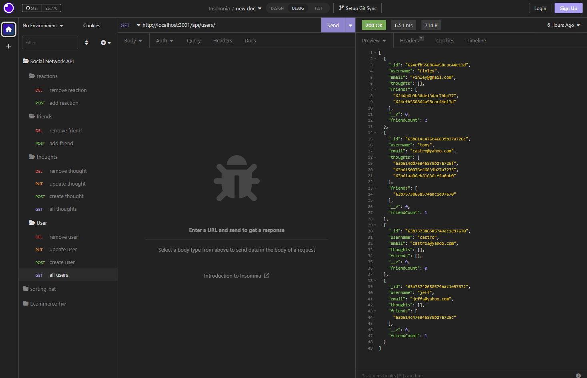

# Social-Network-Api

## Description

My task was to build an API for a social network web app where users can create a friend list, share their thoughts and react to friends thoughts. I built the back-end using MongoDB, Mongoose ODM, and Express.js for routing. I also used Insomnia to test out the routes to create, update and delete a user or a thought.

## User Story

AS A social media startup
I WANT an API for my social network that uses a NoSQL database
SO THAT my website can handle large amounts of unstructured data

## Acceptance Criteria

GIVEN a social network API
WHEN I enter the command to invoke the application
THEN my server is started and the Mongoose models are synced to the MongoDB database
WHEN I open API GET routes in Insomnia for users and thoughts
THEN the data for each of these routes is displayed in a formatted JSON
WHEN I test API POST, PUT, and DELETE routes in Insomnia
THEN I am able to successfully create, update, and delete users and thoughts in my database
WHEN I test API POST and DELETE routes in Insomnia
THEN I am able to successfully create and delete reactions to thoughts and add and remove friends to a user's friend list

## Review

My Github repo page

-https://github.com/92castro/social-network-api

Watch video walk-through here:

-https://drive.google.com/file/d/1xgSlrBwJjkW0c_QkLX_8RAtg-7Pfg4Cx/view

